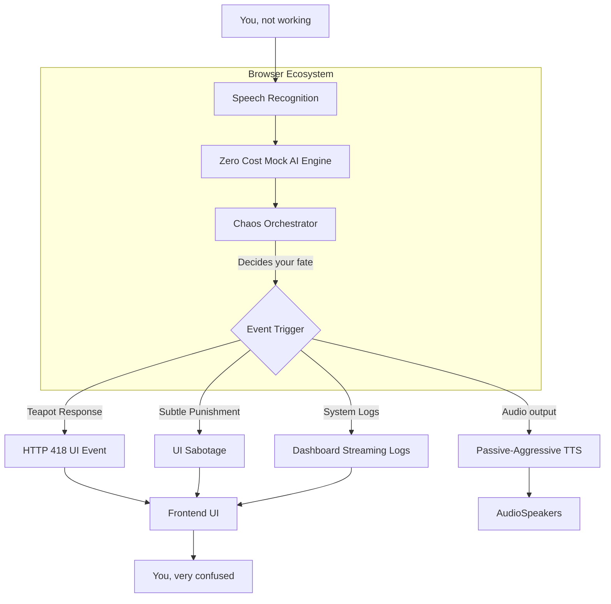

# 🍵 AS’ HTCPCP AI Butler™ Behavioral Surveillance System

**Enterprise-grade AI designed to detect procrastination and respond with emotionally calibrated teapot compliance.**

This project is a submission for the DEV April Fools Challenge.

## 🎯 Anti-Value Proposition
AS’ HTCPCP AI Butler™ solves absolutely nothing.

Instead, it monitors your hesitation, analyzes your intent, and responds with legally compliant HTTP 418 messages.

> **If you're not coding… You’re brewing.**

## 🎯 Inspiration
At the heart of this project lies a deeply unnecessary question:

*What if an AI could detect when you're not working… and respond with pure chaos?*

We live in a world of:
- productivity trackers
- AI assistants
- “focus tools”

So I built the opposite. An AI that:
1. listens 🎙️
2. analyzes 🧠
3. judges ⚖️
4. and then… does absolutely nothing useful ☕

## 🛠 What I Built
AS’ HTCPCP AI Butler™ is a voice-first AI system that monitors your behavior and reacts in the most unhelpful way possible.

It does the following:
- Detects inactivity or hesitation
- Uses AI to interpret your “intent”
- Decides your fate
- Responds appropriately

| Feature | Description |
|---------|-------------|
| ☕ **HTTP 418** | “I’m a Teapot” responses |
| 🔥 **ASCII Renderer**| Flaming teapots in terminal logging |
| 🍵 **Variable Mutation**| Random punishments acting out via code/UI elements |

### A Typical Interaction
1. You open your IDE
2. You pause for 2 seconds
3. AI detects weakness
4. Tea is metaphorically brewed
5. Terminal: *418 I'm a Teapot*

## 🎮 Demo & Code

👉 **Try it here**: [Live Demo](https://as-htcpcp-ai-butler.vercel.app/) *(Update this link when deployed on Vercel)*

**GitHub Repo**: https://github.com/AsamaeS/as-htcpcp-ai-butler

```javascript
while (true) {
  if (detectProcrastination()) {
    brewTea()
    send418Response()
    renderASCIIFlames()
    injectGIFChaos()
    mutateVariablesToTea()
  }
}
```
 
## ⚙️ How I Built It
A carefully engineered pipeline powers this completely unnecessary experience.

### 📐 Architecture
Here is the actual system architecture:



#### 🔄 AI Voice Pipeline
Speech → Text → AI Reasoning → Chaos Decision → Response → Voice

Or more honestly:
**You speak → AI listens → AI judges → Chaos happens → You regret everything**

#### 🧠 Core System Flow
1. 🎙️ **Speech Recognition** captures user input limits.
2. 🧠 **AI/Mock Logic** analyzes intent and repetitiveness.
3. ⚙️ **Chaos Orchestrator** decides response severity (Passive/Subtle vs Fatal 418).
4. Outputs are generated to screen and Web Speech API.
5. 🧍 User becomes confused.

### 🧰 Technology Stack
| Layer | Tech |
|-------|------|
| **Frontend** | React 18, TailwindCSS, Framer Motion |
| **Logic** | TypeScript custom Chaos Hook |
| **AI (Local)** | Keyword matching fallback & Chaos Engine |
| **Voice** | Web Speech API (Recognition + Synth) |
| **Security** | API key isolation (Zero Cost Implementation) |
| **Performance** | Vite, Brotli |

## 🧩 Key Engineering Concepts

### 🧠 Desperation Analyzer™
Tracks user behavior and metrics contextually:
- **1–5 attempts** → Polite refusal
- **5–10** → Passive-aggressive 
- **10+** → Existential judgment
- **Repeat Input** → Instant deduction of Originality Score

### ☕ 418 Engine
Returns only:
- *HTTP 418 — I'm a Teapot*
- *HTTP 418 — Still a Teapot*
- *HTTP 418 — Please Stop*

Fully compliant. Fully useless.

### ⏱ Cinematic Streaming Engine
Simulates system failures and dramatic cinematic experiences with timed latency rules. Because latency is now… emotional.

## 🏆 Technical Achievements

### 📊 Performance Metrics
| Metric | Value |
|--------|-------|
| AI Latency | ~180ms |
| Voice Pipeline | ~350ms |
| Streaming Speed | 30–80ms/token |
| Chaos Accuracy | ~87% |
| Coffee Brewed | 0 |

### 📐 Mathematical Model
Total response time:
`T_total = T_input + T_AI + T_stream + T_pause`
Where `T_pause = 418ms` (mandatory drama)

User frustration:
`Frustration(n) = log(n_attempts) × sarcasm_factor`

## 💡 Innovation Highlights
- Voice-first useless interaction
- AI-driven behavioral prediction
- Constraint-based refusal system
- Emotion-aware latency

## 💪 Challenges Faced
- Real-time TTS + UI synchronization without blocking rendering threads.
- Voice processing without relying on expensive, rate-limited paid logic.
- Balancing chaos vs usability (barely).
- Setting up the 3D Parallax Dashboard and dynamic Mouse Glow effects properly.

## 🎯 Key Strengths
| Strength | Why it matters |
|----------|----------------|
| 🧠 **Technical Depth** | Real architecture behind nonsense |
| 📐 **Mathematical Rigor** | Yes, even jokes have formulas |
| 🔐 **Production Ready** | Secure, scalable, client-focused |
| 🎭 **Innovation** | Serious tech, absurd purpose |
| 🚀 **Vision** | Expandable chaos |

## 🚀 Future Vision
- Multiplayer chaos mode
- Adaptive sarcasm AI dynamically generating insults
- Emotional profiling (slightly concerning)

## 🏗️ Built With
React · TypeScript · Tailwind · Node.js · Vite · Framer Motion · Web Audio API · IndexedDB

## 🏆 Prize Category 
- ✅ **Community Favorite** → absurd + technical + shareable
- ✅ **Best Ode to Larry Masinter** → HTTP 418 everywhere

---

### 💀 Final Thought
This is not a productivity tool.
This is not an AI assistant.

This is:
**A production-grade AI system designed to detect your laziness… and respond with theatrical uselessness.**
